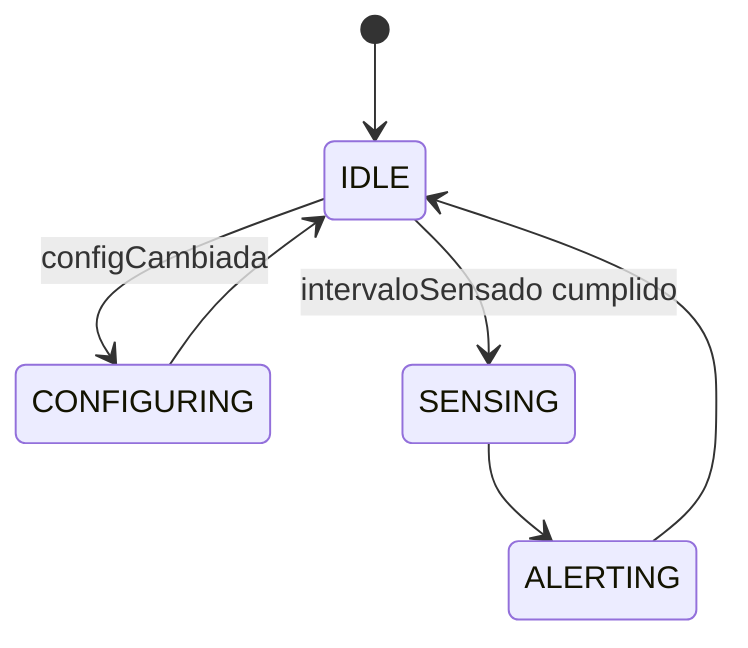

# Arquitectura SafeHome

## Informacion extraida del firmware funcional

SafeHome es un sistema de seguridad para hogar con monitoreo ambiental y deteccion de movimiento.

### Sensores

| Sensor | Funcion | Conexion |
| --- | --- | --- |
| AHT20 | Temperatura y humedad | I2C SDA 21, SCL 22 |
| BMP280 | Temperatura y presion | I2C SDA 21, SCL 22 |
| PIR | Movimiento | GPIO 13 |
| LDR | Luz ambiente | GPIO 34 ADC1 |

### Actuadores

| Actuador | Funcion | Conexion |
| --- | --- | --- |
| Relay | Encendido de luz por baja iluminacion | GPIO 26 |
| Servo | Apertura temporal por movimiento | GPIO 27 PWM |

### Parametros

| Parametro | Default | Uso |
| --- | ---: | --- |
| `umbralLuz` | 60 | Activa relay si `ldr < umbralLuz` |
| `umbralTemp` | 30.0 | Genera alerta serial si `tempAHT >= umbralTemp` |
| `tiempoServo` | 3000 | Mantiene servo abierto antes de cerrarlo |
| `intervaloSensado` | 2000 | Controla la frecuencia de lectura |

## Modulos ESP32

- `SafeHome.ino`: setup, loop y maquina de estados.
- `config.h`: pines, TCP, credenciales externas y estructuras compartidas.
- `sensors.cpp`: inicializa AHT20, BMP280, PIR y LDR; devuelve `SensorData`.
- `actuators.cpp`: controla relay y servo; mantiene temporizador no bloqueante del servo.
- `api.cpp`: servidor `ESPAsyncWebServer`, LittleFS, CORS, `/api/status` y `/api/config`.
- `tcp_client.cpp`: envia JSON por TCP a la PC.
- `WiFiManagerESP.cpp`: conexion WiFi y autenticacion de portal cautivo ITSON.

## Maquina de estados ESP32



## API REST

### `GET /api/status`

Devuelve:

```json
{
  "sensores": {
    "tempAHT": 25.2,
    "humedad": 42.1,
    "tempBMP": 25.5,
    "presion": 1012.4,
    "ldr": 1234,
    "pir": false,
    "timestamp": "12000"
  },
  "actuadores": {
    "relay": false,
    "servo": false
  },
  "config": {
    "umbralLuz": 60,
    "umbralTemp": 30,
    "tiempoServo": 3000,
    "intervaloSensado": 2000
  }
}
```

### `POST /api/config`

Acepta uno o mas campos:

```json
{
  "umbralLuz": 60,
  "umbralTemp": 30,
  "tiempoServo": 3000,
  "intervaloSensado": 2000
}
```

## TCP

El ESP32 envia una linea JSON al servidor configurado en `TCP_SERVER_IP:TCP_SERVER_PORT`.

```json
{
  "tempAHT": 25.2,
  "humedad": 42.1,
  "tempBMP": 25.5,
  "presion": 1012.4,
  "ldr": 1234,
  "pir": false,
  "timestamp": "12000"
}
```

## Modulos Python

- `collector/server.py`: servidor TCP independiente que inserta lecturas en MySQL.
- `gui/app.py`: GUI para estado, parametros, representacion fisica y graficas.
- `services/esp32_api.py`: cliente REST para `/api/status` y `/api/config`.
- `services/database.py`: consultas e inserciones MySQL.
- `models/reading.py`: modelo de lectura SafeHome.
