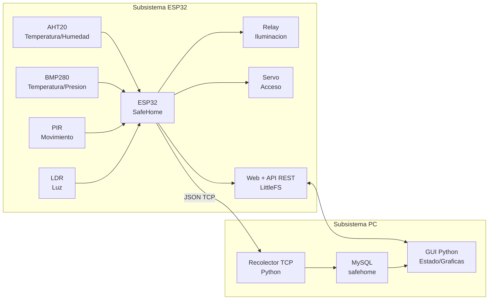
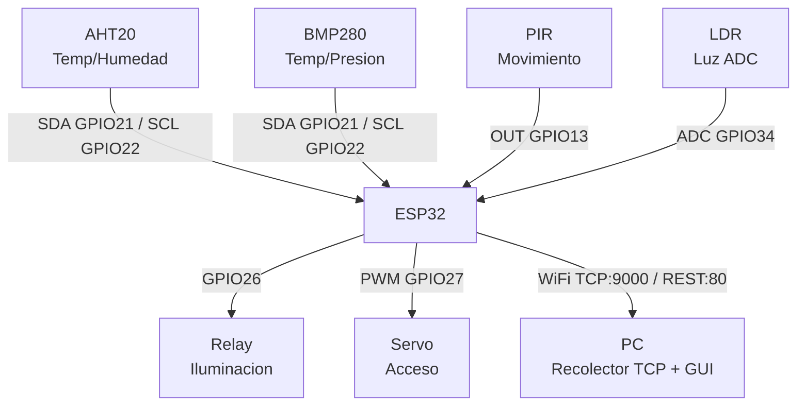
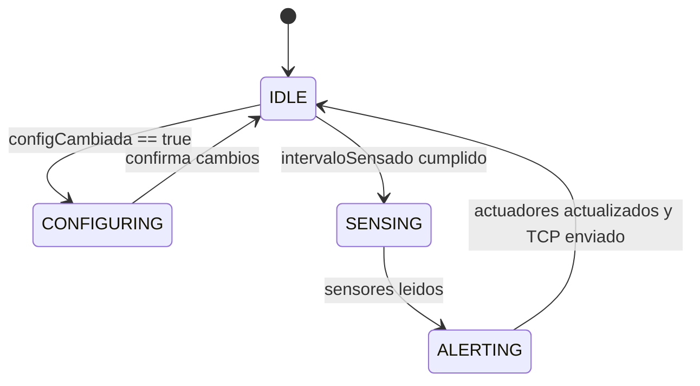
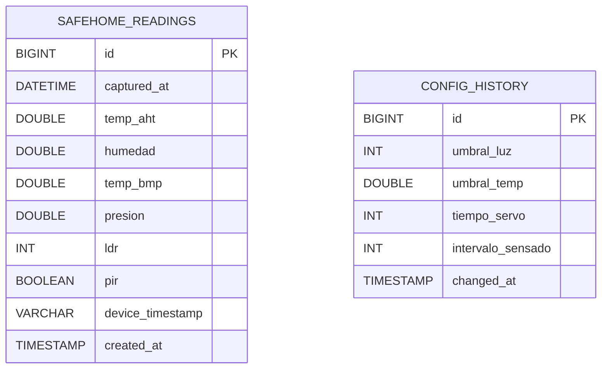

# SafeHome - Documentacion de rubrica

Proyecto final de Sistemas Empotrados.

Este documento cubre las 9 tareas de documentacion solicitadas en la rubrica, tomando como base el codigo ESP32 funcional proporcionado para SafeHome y el subsistema Python generado para PC.

## 1. Entrega PDF manual usuario

El manual de usuario se entrega como documento PDF generado a partir de esta documentacion:

- Archivo fuente: `docs/documentacion_rubrica_9_tareas.md`
- Archivo PDF: `docs/manual_usuario_safehome.pdf`

El manual contiene el contexto del sistema, su modelo conceptual, conexiones fisicas, diagramas, estructura de base de datos, descripcion del codigo y pasos de reconstruccion.

## 2. Modelo conceptual incluido

SafeHome es un sistema de seguridad y monitoreo para hogar basado en ESP32. El sistema mide condiciones ambientales y presencia, controla actuadores y comunica la informacion a una aplicacion de PC.

### Objetivo del sistema

Monitorear el entorno de una vivienda mediante sensores conectados a un ESP32, activar actuadores ante condiciones definidas y almacenar historicos en una base de datos local para consulta desde una interfaz grafica.

### Componentes principales

- **ESP32:** unidad de control embebida.
- **Sensores:** AHT20, BMP280, PIR y LDR.
- **Actuadores:** relay y servo.
- **Servidor web:** interfaz servida desde LittleFS en el ESP32.
- **API REST:** endpoints para consultar estado y modificar configuracion.
- **Comunicacion TCP:** envio de lecturas desde ESP32 a la PC.
- **Recolector Python:** servidor TCP que recibe lecturas.
- **MySQL:** almacenamiento local de historicos.
- **GUI Python:** aplicacion para consultar estado, modificar parametros y visualizar graficas.

### Flujo conceptual



### Parametros configurables

| Parametro | Tipo | Valor default | Funcion |
| --- | --- | ---: | --- |
| `umbralLuz` | Entero ADC | `60` | Activa el relay cuando `ldr < umbralLuz`. |
| `umbralTemp` | Decimal C | `30.0` | Genera alerta cuando `tempAHT >= umbralTemp`. |
| `tiempoServo` | Entero ms | `3000` | Tiempo que el servo permanece abierto. |
| `intervaloSensado` | Entero ms | `2000` | Periodo entre ciclos de lectura. |

## 3. Esquematico incluido

El esquematico logico identifica los sensores, actuadores y pines usados por el codigo SafeHome.

### Tabla de conexiones

| Componente | Pin/Bus ESP32 | Tipo de senal | Funcion |
| --- | --- | --- | --- |
| AHT20 SDA | GPIO 21 | I2C SDA | Datos de temperatura y humedad |
| AHT20 SCL | GPIO 22 | I2C SCL | Reloj I2C |
| BMP280 SDA | GPIO 21 | I2C SDA | Datos de temperatura y presion |
| BMP280 SCL | GPIO 22 | I2C SCL | Reloj I2C |
| PIR OUT | GPIO 13 | Entrada digital | Movimiento |
| LDR | GPIO 34 | Entrada analogica ADC1 | Luz ambiente |
| Relay IN | GPIO 26 | Salida digital | Control de iluminacion |
| Servo signal | GPIO 27 | PWM | Control de acceso |
| VCC sensores | 3.3 V | Alimentacion | Energia de sensores |
| GND comun | GND | Tierra | Referencia electrica |

### Diagrama de conexion logica



### Consideraciones de protoboard

- Todos los modulos deben compartir tierra con el ESP32.
- El bus I2C se comparte entre AHT20 y BMP280.
- El pin GPIO 34 es solo entrada, por eso es adecuado para el LDR.
- El relay debe manejarse respetando el modulo utilizado; si el relay es de 5 V se debe verificar compatibilidad de nivel logico.
- El servo puede requerir alimentacion externa si consume mas corriente de la que el ESP32 puede entregar.

## 4. Diagrama de estados

El firmware del ESP32 trabaja con una maquina de estados definida en `SafeHome.ino`.

### Estados

| Estado | Responsabilidad |
| --- | --- |
| `IDLE` | Espera el intervalo de sensado o un cambio de configuracion. |
| `SENSING` | Lee todos los sensores y actualiza `ultimaLectura`. |
| `ALERTING` | Evalua umbrales, actualiza actuadores y envia datos por TCP. |
| `CONFIGURING` | Atiende cambios recibidos por API REST y muestra configuracion actual. |

### Diagrama



### Funcionamiento no bloqueante

El codigo evita `delay()`. El ciclo principal revisa `millis()` para determinar si ya se cumplio `intervaloSensado`. Ademas, `tickActuators(config)` se ejecuta en cada iteracion para cerrar el servo cuando vence `tiempoServo`.

## 5. Diagrama entidad-relacion

La base de datos definida en `SEpython/sql/schema.sql` crea la base `safehome` y dos tablas: `safehome_readings` y `config_history`.



### Relacion logica

Actualmente las tablas no tienen una llave foranea directa. La relacion es funcional:

- `safehome_readings` registra cada lectura recibida desde ESP32.
- `config_history` esta prevista para registrar cambios de parametros.

Si se desea relacion estricta, se puede agregar una tabla de configuraciones activas y registrar en cada lectura el identificador de configuracion usada.

## 6. Descripcion de tablas

### Tabla `safehome_readings`

Almacena las lecturas recibidas por el servidor TCP Python.

| Campo | Tipo | Descripcion |
| --- | --- | --- |
| `id` | `BIGINT UNSIGNED` | Identificador unico autoincremental. |
| `captured_at` | `DATETIME` | Fecha y hora en que la PC recibio la lectura. |
| `temp_aht` | `DOUBLE` | Temperatura medida por AHT20 en C. |
| `humedad` | `DOUBLE` | Humedad relativa medida por AHT20 en %. |
| `temp_bmp` | `DOUBLE` | Temperatura medida por BMP280 en C. |
| `presion` | `DOUBLE` | Presion barometrica medida por BMP280 en hPa. |
| `ldr` | `INT` | Valor analogico de luz en escala ADC 0-4095. |
| `pir` | `BOOLEAN` | Indica si se detecto movimiento. |
| `device_timestamp` | `VARCHAR(32)` | Marca de tiempo enviada por ESP32 basada en `millis()`. |
| `created_at` | `TIMESTAMP` | Fecha automatica de insercion en MySQL. |

Indice:

- `idx_safehome_readings_captured_at`: acelera busquedas por rango de fecha.

### Tabla `config_history`

Tabla prevista para conservar historial de parametros configurables.

| Campo | Tipo | Descripcion |
| --- | --- | --- |
| `id` | `BIGINT UNSIGNED` | Identificador unico autoincremental. |
| `umbral_luz` | `INT` | Umbral de luz configurado. |
| `umbral_temp` | `DOUBLE` | Umbral de temperatura configurado. |
| `tiempo_servo` | `INT` | Tiempo configurado para mantener el servo abierto. |
| `intervalo_sensado` | `INT` | Intervalo configurado entre lecturas. |
| `changed_at` | `TIMESTAMP` | Fecha automatica del cambio. |

Nota: la tabla existe en el script SQL, pero el guardado automatico de cambios de configuracion todavia no se implementa en la API Python.

## 7. Codigo ESP32 documentado

El codigo ESP32 se encuentra en `SEesp32/SafeHome`. Es el firmware SafeHome funcional proporcionado, conservado de forma literal para Arduino IDE.

### Archivos del firmware

| Archivo | Proposito |
| --- | --- |
| `SafeHome.ino` | Contiene `setup()`, `loop()`, maquina de estados y variables globales. |
| `config.h` | Define pines, IP/puerto TCP, parametros default y estructuras `Config` y `SensorData`. |
| `sensors.h/.cpp` | Inicializa y lee AHT20, BMP280, PIR y LDR. |
| `actuators.h/.cpp` | Controla relay y servo segun sensores y parametros. |
| `api.h/.cpp` | Implementa servidor web, LittleFS y API REST. |
| `tcp_client.h/.cpp` | Serializa lecturas en JSON y las envia por TCP. |
| `WiFiManagerESP.h/.cpp` | Gestiona WiFi y autenticacion de portal cautivo ITSON. |
| `data/index.html` | Interfaz web del ESP32. |
| `data/style.css` | Estilos de la interfaz web. |

### `setup()`

Responsabilidades:

1. Inicia puerto serial a `115200`.
2. Inicializa sensores con `initSensors()`.
3. Inicializa actuadores con `initActuators()`.
4. Monta LittleFS para servir la interfaz web.
5. Conecta WiFi con `wifiManager.connectToWiFi()`.
6. Inicializa la API REST con `initAPI(&config, &ultimaLectura, &configCambiada)`.
7. Realiza una lectura inicial con `readSensors()`.

### `loop()`

Responsabilidades:

1. Calcula el tiempo actual con `millis()`.
2. Ejecuta `tickActuators(config)` para cerrar el servo sin bloquear.
3. Ejecuta la maquina de estados:
   - `IDLE`: espera eventos.
   - `SENSING`: lee sensores.
   - `ALERTING`: actualiza actuadores y envia TCP.
   - `CONFIGURING`: confirma cambios de parametros.

### Lectura de sensores

`readSensors()` obtiene:

- Temperatura y humedad del AHT20.
- Temperatura y presion del BMP280.
- Movimiento del PIR mediante `digitalRead(PIN_PIR)`.
- Luz ambiental del LDR mediante `analogRead(PIN_LDR)`.
- Timestamp basado en `millis()`.

### Control de actuadores

`updateActuators(data, config)` ejecuta:

- Relay encendido si `data.ldr < config.umbralLuz`.
- Alerta serial si `data.tempAHT >= config.umbralTemp`.
- Servo abierto a 90 grados si `data.pir` es verdadero y el servo no esta abierto.

`tickActuators(config)` cierra el servo cuando vence `config.tiempoServo`.

### API REST

`GET /api/status` devuelve:

```json
{
  "sensores": {
    "tempAHT": 25.2,
    "humedad": 42.1,
    "tempBMP": 25.5,
    "presion": 1012.4,
    "ldr": 1234,
    "pir": false,
    "timestamp": "12000"
  },
  "actuadores": {
    "relay": false,
    "servo": false
  },
  "config": {
    "umbralLuz": 60,
    "umbralTemp": 30.0,
    "tiempoServo": 3000,
    "intervaloSensado": 2000
  }
}
```

`POST /api/config` recibe uno o mas parametros:

```json
{
  "umbralLuz": 100,
  "umbralTemp": 30.0,
  "tiempoServo": 3000,
  "intervaloSensado": 2000
}
```

### Envio TCP

`sendDataTCP(ultimaLectura)` conecta con `TCP_SERVER_IP:TCP_SERVER_PORT` y envia una linea JSON con los sensores.

## 8. Codigo Python documentado

El codigo Python se encuentra en `SEpython/pc_app` y se divide en recolector TCP, GUI, modelos y servicios.

### Estructura Python

| Archivo | Proposito |
| --- | --- |
| `pc_app/config.py` | Lee configuracion desde variables de entorno. |
| `pc_app/models/reading.py` | Define el modelo `Reading`. |
| `pc_app/services/database.py` | Conecta a MySQL, inserta y consulta lecturas. |
| `pc_app/services/esp32_api.py` | Cliente REST para consultar y configurar ESP32. |
| `pc_app/collector/server.py` | Servidor TCP independiente que recibe JSON del ESP32. |
| `pc_app/gui/app.py` | GUI de usuario con Tkinter y graficas con Matplotlib. |

### Recolector TCP

Archivo: `SEpython/pc_app/collector/server.py`

Funcionamiento:

1. Abre un servidor TCP en `settings.tcp_host:settings.tcp_port`.
2. Espera lineas JSON enviadas por ESP32.
3. Convierte el JSON en un objeto `Reading`.
4. Inserta la lectura en MySQL usando `insert_reading(reading)`.

Campos esperados en el JSON TCP:

- `tempAHT`
- `humedad`
- `tempBMP`
- `presion`
- `ldr`
- `pir`
- `timestamp`

### Cliente REST

Archivo: `SEpython/pc_app/services/esp32_api.py`

Funciones:

- `get_state()`: consulta `GET /api/status`.
- `update_config(...)`: envia `POST /api/config`.

### Servicio de base de datos

Archivo: `SEpython/pc_app/services/database.py`

Funciones:

- `connect()`: abre conexion MySQL.
- `insert_reading(reading)`: inserta una lectura en `safehome_readings`.
- `fetch_readings(start, end)`: consulta lecturas por periodo.

### GUI Python

Archivo: `SEpython/pc_app/gui/app.py`

Funciones principales:

- Muestra parametros configurables.
- Consulta el estado del ESP32 cada 3 segundos.
- Permite guardar configuracion por API REST.
- Dibuja una representacion del sistema fisico.
- Grafica temperatura AHT20, humedad y LDR.
- Permite seleccionar periodo: ultima hora, 6 horas o 24 horas.

## 9. Instrucciones de reconstruccion

Esta seccion describe como reconstruir y ejecutar el proyecto desde cero.

### 9.1 Requisitos

Hardware:

- ESP32 Dev Module.
- Sensor AHT20.
- Sensor BMP280.
- Sensor PIR.
- LDR con resistencia para divisor de voltaje.
- Relay.
- Servo.
- Protoboard y cables.
- PC con Windows.

Software:

- Arduino IDE.
- Core ESP32 instalado en Arduino IDE.
- Python 3.12 o entorno virtual incluido.
- MySQL Server.

Librerias Arduino:

- `ArduinoJson`
- `ESP Async WebServer`
- `Async TCP`
- `ESP32Servo`
- `Adafruit AHTX0`
- `Adafruit BMP280 Library`
- `Adafruit Unified Sensor`
- `Adafruit BusIO`

Dependencias Python:

- `mysql-connector-python`
- `requests`
- `matplotlib`

### 9.2 Conectar hardware

1. Conectar AHT20 y BMP280 al bus I2C del ESP32:
   - SDA a GPIO 21.
   - SCL a GPIO 22.
   - VCC a 3.3 V.
   - GND a GND.
2. Conectar PIR:
   - OUT a GPIO 13.
   - VCC segun modulo.
   - GND a GND.
3. Conectar LDR:
   - Salida del divisor de voltaje a GPIO 34.
4. Conectar relay:
   - IN a GPIO 26.
   - VCC y GND segun modulo.
5. Conectar servo:
   - Signal a GPIO 27.
   - VCC segun consumo del servo.
   - GND comun con ESP32.

### 9.3 Configurar ESP32

1. Abrir Arduino IDE.
2. Abrir el sketch:

```text
SEesp32/SafeHome/SafeHome.ino
```

3. Seleccionar tarjeta:

```text
ESP32 Dev Module
```

4. Editar credenciales WiFi en `SafeHome.ino`:

```cpp
const char* WIFI_SSID     = "NOMBRE_RED";
const char* WIFI_PASSWORD = "PASSWORD_RED";
const char* WIFI_USER     = "";
const char* WIFI_PASS     = "";
```

5. Editar IP de la PC en `config.h`:

```cpp
#define TCP_SERVER_IP   "IP_DE_LA_PC"
#define TCP_SERVER_PORT 9000
```

6. Compilar el sketch.
7. Conectar ESP32 por USB.
8. Seleccionar puerto.
9. Subir firmware.
10. Subir archivos de LittleFS desde la carpeta `data`.

### 9.4 Configurar MySQL

1. Abrir MySQL Workbench o consola MySQL.
2. Ejecutar el script:

```text
SEpython/sql/schema.sql
```

Esto crea:

- Base de datos `safehome`.
- Tabla `safehome_readings`.
- Tabla `config_history`.

### 9.5 Configurar Python

Desde PowerShell:

```powershell
cd C:\Users\emili\Desktop\SE\SEpython
.\.venv\Scripts\activate
pip install -r requirements.txt
```

Si se usan variables de entorno, configurar:

- `ESP32_BASE_URL`
- `TCP_HOST`
- `TCP_PORT`
- `MYSQL_HOST`
- `MYSQL_PORT`
- `MYSQL_USER`
- `MYSQL_PASSWORD`
- `MYSQL_DATABASE`

### 9.6 Ejecutar recolector TCP

Desde `SEpython`:

```powershell
.\run_collector.ps1
```

O manualmente:

```powershell
python -m pc_app.collector.server
```

### 9.7 Ejecutar GUI

Desde `SEpython`:

```powershell
.\run_gui.ps1
```

O manualmente:

```powershell
python -m pc_app.gui.app
```

### 9.8 Verificar funcionamiento

1. Abrir monitor serial del ESP32.
2. Confirmar conexion WiFi.
3. Confirmar lectura de sensores.
4. Abrir navegador en la IP del ESP32.
5. Verificar que `/api/status` devuelva JSON.
6. Cambiar parametros desde la web o GUI.
7. Confirmar activacion de relay con baja luz.
8. Confirmar apertura de servo con movimiento PIR.
9. Confirmar que el recolector recibe datos TCP.
10. Confirmar que MySQL guarda registros.
11. Confirmar que la GUI muestra estado y graficas.

## Observaciones para evaluacion

- El codigo ESP32 no usa `delay()`.
- La temporizacion se implementa con `millis()`.
- Si la rubrica exige estrictamente `NoDelay`, se debe migrar el temporizador de sensado a esa biblioteca.
- La interfaz web del ESP32 usa HTML, CSS y JavaScript embebido para consumir la API. Si el profesor restringe estrictamente a HTML/CSS/C/Python, se debe reemplazar el JavaScript por HTML generado desde C++ o formularios tradicionales.

